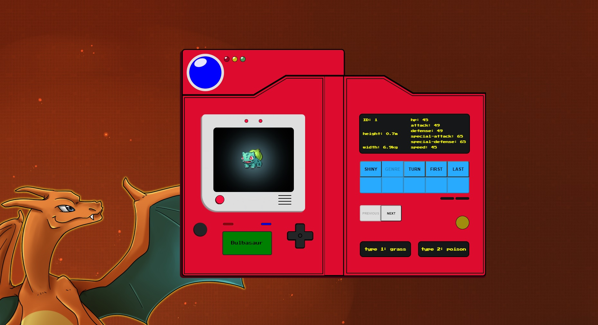

<h1 align=center>Reactdex</h1>

A Pokedex made with React

# Project

Project made with the intention to simulate a real pokedex from the Pokemon series. All the data from the pokemons where acquired from the [PokeAPI](https://pokeapi.co/).

## Technologies

---

- [React](https://pt-br.reactjs.org/)
- [Styled-Components](https://www.styled-components.com/)
- [Axios](https://github.com/axios/axios)
